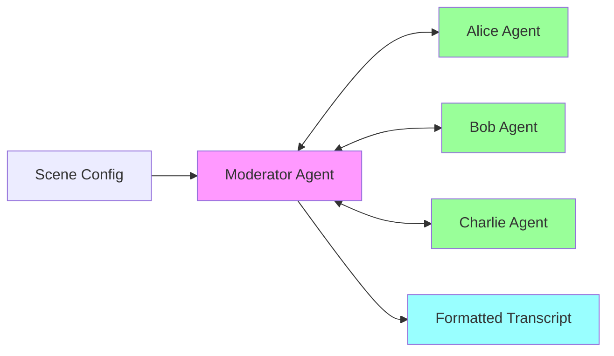
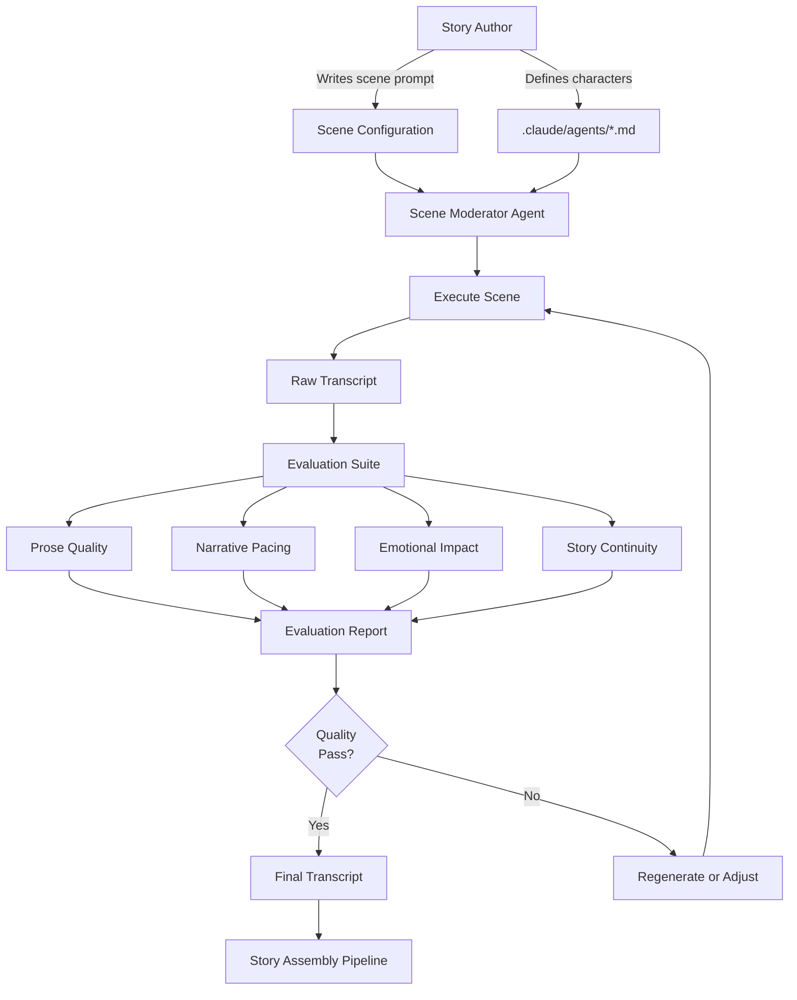

# Scene Moderator Agent

**A Claude-powered multi-agent system for generating authentic narrative dialog through emergent character interaction.**


---

## Overview

The Scene Moderator Agent orchestrates multi-character narrative scenes where each character is an independent AI agent with autonomous decision-making. Unlike traditional single-agent approaches where one AI "roleplays" all characters, this system creates genuine emergence through:

- **Independent Character Agents** - Each character evaluates scenes separately with no shared knowledge
- **Parallel Communication** - All characters respond simultaneously to scene events
- **Authentic Interactions** - Interruptions, silence, and emotional reactions emerge organically
- **Natural Dialog** - Minimal formatting constraints allow expressive, human-like responses



**This is a scene execution engine** - characters and stories are defined externally. We orchestrate; you create.

---

## The Vision: End State

### What We're Building Toward

A production-ready narrative scene engine that:

1. **Executes scenes autonomously** with zero human intervention
2. **Produces industry-quality dialog** indistinguishable from human-written scenes
3. **Scales efficiently** with optimized token usage and prompt caching
4. **Evaluates its own output** using AI agents trained on film/theater best practices
5. **Integrates seamlessly** into larger story generation pipelines

### Target Workflow



### End State Capabilities

- **Character Memory**: Characters remember previous scenes and relationships
- **Multi-Scene Story Arcs**: Track character development across entire narratives
- **Adaptive Pacing**: AI moderator adjusts scene length based on story needs
- **Style Matching**: Generate scenes in specific author/director styles
- **Quality Assurance**: Automated evaluation prevents low-quality output
- **Cost Optimization**: $0.30-0.50 per scene via prompt caching (vs $1.50 today)

---

## Path to Production

### Phase 1: Proof of Concept (Current)
**Goal:** Validate the multi-agent approach works

- ✅ Structured PRD with visual documentation
- ⬜ Core scene execution loop
- ⬜ Character agent communication via Task API
- ⬜ Response format parsing (natural language)
- ⬜ Scene completion detection
- ⬜ Interruption handling (async timestamp-based)
- ⬜ Basic transcript generation
- ⬜ Test coverage > 80%

**Success Criteria:**
- 2-3 character scenes complete autonomously
- Dialog feels natural (human eval > 3.5/5)
- 80% scene goal achievement rate
- ~$1-2 per scene cost (acceptable for POC)

### Phase 2: Optimization
**Goal:** Make it production-ready and cost-efficient

- ⬜ Migrate to Direct Messages API
- ⬜ Implement conversation threads (character memory)
- ⬜ Enable prompt caching (70%+ cost reduction)
- ⬜ Character definition evaluator
- ⬜ Support 4-5 character scenes
- ⬜ World event injection system
- ⬜ Advanced completion detection

**Success Criteria:**
- Cost reduced to < $0.50 per scene
- Processing time < 30s for 15-beat scene
- Characters maintain consistency across scenes
- 90% goal achievement rate

### Phase 3: Quality & Evaluation
**Goal:** Add professional-grade quality assurance

- ⬜ Narrative Prose Synthesis evaluator
- ⬜ Elite Narrative Pacing evaluator
- ⬜ Emotional Impact evaluator
- ⬜ Story Continuity evaluator
- ⬜ Automated quality gating
- ⬜ Style matching capabilities
- ⬜ Scene regeneration on quality failure

**Success Criteria:**
- Automated evaluation scores correlate with human judgment
- 95%+ scenes pass quality checks
- Evaluation overhead < 10% of scene cost

### Phase 4: Scale & Integration
**Goal:** Production deployment and ecosystem integration

- ⬜ Multi-scene story arc management
- ⬜ Character relationship tracking
- ⬜ API for external story engines
- ⬜ Performance monitoring dashboard
- ⬜ Cost analytics and budgeting
- ⬜ Parallel scene execution

---

## Feature Checklist

### Core Features (Phase 1)

- [ ] **Multi-Character Communication**
  - [ ] Load character definitions from `.claude/agents/*.md`
  - [ ] Initialize character agents (ICharacterAgent interface)
  - [ ] Parallel scene update dispatch
  - [ ] Response collection with timestamps
  - [ ] Timestamp-based ordering (interruption support)
  - [ ] Scene completion evaluation
  - [ ] Error handling and graceful degradation

- [ ] **Response Format Parsing**
  - [ ] Strict regex parser for standard format
  - [ ] Salvage logic for malformed responses
  - [ ] Extract: action, target, tone, content, nonverbal
  - [ ] Support: speak, interrupt, silent, react actions
  - [ ] Warning flags on parse failures
  - [ ] 90%+ parse success rate

- [ ] **Scene Completion Detection**
  - [ ] Goal achievement evaluation
  - [ ] Natural ending detection
  - [ ] Moderator guidance injection ("wrap up")
  - [ ] Max beats safety limit
  - [ ] Completion reason tracking

- [ ] **Interruption Handling**
  - [ ] Async response collection
  - [ ] Timestamp-based ordering
  - [ ] "Interrupt after phrase" parsing
  - [ ] Overlapping dialog support
  - [ ] Stacked interruptions

- [ ] **World Event Injection**
  - [ ] Moderator-triggered events
  - [ ] Event formatting in transcript
  - [ ] Character response to events
  - [ ] Scene redirection via events

- [ ] **Transcript Generation**
  - [ ] Human-readable formatting
  - [ ] Timestamp and beat tracking
  - [ ] Speaker, tone, and action labels
  - [ ] Non-verbal action display
  - [ ] Statistics footer
  - [ ] Metadata JSON output

### Infrastructure (Phase 1)

- [ ] **Testing**
  - [ ] Unit tests for parsers
  - [ ] Unit tests for moderator logic
  - [ ] Integration tests for full scenes
  - [ ] Mock character agents
  - [ ] Test coverage > 80%

- [ ] **Documentation**
  - [ ] TSDoc for all public APIs
  - [ ] Example character definitions
  - [ ] Example scene configs
  - [ ] Implementation lessons.md files

- [ ] **Tooling**
  - [ ] TypeScript build pipeline
  - [ ] Linting (ESLint)
  - [ ] Type checking (strict mode)
  - [ ] Test runner (Vitest/Jest)

### Enhancement Features (Phase 2+)

- [ ] **Direct API Integration**
  - [ ] DirectCharacterAgent implementation
  - [ ] Conversation thread persistence
  - [ ] Prompt caching setup
  - [ ] Performance comparison tooling

- [ ] **Character Quality**
  - [ ] Character definition evaluator
  - [ ] Depth and dimension checks
  - [ ] Format understanding validation
  - [ ] Actionable feedback generation

- [ ] **Scene Evaluation**
  - [ ] Narrative Prose Synthesis agent
  - [ ] Elite Narrative Pacing agent
  - [ ] Emotional Impact agent
  - [ ] Story Continuity agent
  - [ ] Evaluation report generation
  - [ ] Quality gating system

- [ ] **Advanced Capabilities**
  - [ ] Multi-scene character memory
  - [ ] Relationship tracking
  - [ ] Style matching
  - [ ] Genre-specific conventions
  - [ ] Parallel scene execution
  - [ ] Cost analytics dashboard

---

## Project Structure

```
moderator-agent/
├── README.md                          # This file
├── FEATURE_IDEAS.md                   # Future enhancement ideas
├── PRD-original.md                    # Original monolithic PRD (reference)
├── moderator-agent-prd/               # Structured PRD
│   ├── README.md                      # PRD navigation hub
│   ├── core/                          # Foundational documents
│   │   ├── problem-statement.md
│   │   ├── design-principles.md
│   │   ├── success-metrics.md
│   │   ├── constraints.md
│   │   └── feature-creation.md
│   ├── features/                      # Feature specifications
│   │   ├── multi-character-communication/
│   │   ├── response-format-parsing/
│   │   └── [6 feature directories...]
│   ├── architecture/                  # System design
│   │   └── data-model.md
│   └── development/                   # Implementation guides
│       ├── ai-guidelines.md
│       ├── prompts/
│       └── validation/
├── src/                               # Source code (TBD)
├── tests/                             # Test suite (TBD)
└── data/                              # Scene outputs (TBD)
    └── scenes/
```

---

## Quick Start

### For Story Authors

1. **Define your characters** in `.claude/agents/*.md` (in your story project)
2. **Write a scene prompt** describing the situation and goals
3. **Run the moderator** with your scene config
4. **Review the transcript** and adjust character definitions as needed

### For Developers

1. **Read the PRD**: Start with [`moderator-agent-prd/README.md`](moderator-agent-prd/README.md)
2. **Understand the principles**: Review [`core/design-principles.md`](moderator-agent-prd/core/design-principles.md)
3. **Pick a feature**: Begin with [`multi-character-communication`](moderator-agent-prd/features/multi-character-communication/)
4. **Follow TDD**: Use [`development/ai-guidelines.md`](moderator-agent-prd/development/ai-guidelines.md)

### For AI Agents (Claude Code)

Load these files first:
- `moderator-agent-prd/development/ai-guidelines.md`
- Feature specification for what you're implementing
- `moderator-agent-prd/core/design-principles.md`

Then follow the test-first development workflow.

---

## Design Philosophy

### Core Principles

1. **Independence Over Control** - Characters are autonomous, not scripted
2. **Natural Expression** - Minimal formatting, maximum authenticity
3. **Functional Over Imperative** - Pure functions, immutable data
4. **Test-First Development** - Write tests before implementation
5. **Swappable Implementations** - Abstract via interfaces (Task API ↔ Direct API)

See [`core/design-principles.md`](moderator-agent-prd/core/design-principles.md) for complete list.

### Key Innovations

**This hasn't been done before with Claude's agent architecture:**

- Independent character agents via moderator pattern
- Async interruption handling through timestamp ordering
- Natural language parsing with graceful salvage
- Emergent narrative from parallel AI interaction

---

## Technology Stack

### Phase 1 (Current)
- **Runtime**: Node.js 18+
- **Language**: TypeScript (strict mode)
- **Agent SDK**: Claude Code Agent SDK (Task tool)
- **Testing**: Vitest/Jest
- **Formatting**: Natural language with light annotations

### Phase 2 (Future)
- **API**: Anthropic Messages API (Direct)
- **Caching**: Prompt caching for cost optimization
- **Persistence**: Conversation threads for character memory

---

## Contributing

### Feature Development Workflow

1. **Check FEATURE_IDEAS.md** for planned enhancements
2. **Create feature specification** following [`core/feature-creation.md`](moderator-agent-prd/core/feature-creation.md)
3. **Write tests first** per [`development/validation/test-criteria.md`](moderator-agent-prd/development/validation/test-criteria.md)
4. **Implement to pass tests**
5. **Create lessons.md** documenting what you learned
6. **Update PRD README** with feature status

### Code Standards

- TypeScript strict mode (no `any`)
- Functional style (immutable data, pure functions)
- 80%+ test coverage (100% for critical paths)
- TSDoc on all public APIs
- Follow design principles

---

## Current Status

**Phase 1: Planning Complete ✅**

- [x] PRD structure created
- [x] Feature specifications drafted
- [x] Visual diagrams added
- [x] Development guidelines written
- [x] Test criteria defined

**Next Steps:**
- [ ] Initialize TypeScript project
- [ ] Set up testing framework
- [ ] Implement core types and interfaces
- [ ] Build response parser (test-first)
- [ ] Create multi-character communication feature

---

## Future Vision

Imagine a story author writing:

```yaml
scene: office-confrontation
goal: Bob apologizes, Alice accepts, relationship heals
characters: [alice, bob, charlie]
style: Aaron Sorkin
evaluation: strict
```

And receiving back:
- A fully-realized scene with authentic dialog
- Evaluation scores (prose: 8.5/10, pacing: 9/10, emotion: 7.5/10)
- Character relationship deltas (alice→bob: -3 to +2)
- Integration-ready transcript for story assembly

**All autonomous. All emergent. All under $0.50.**

That's where we're headed.

---

## License

MIT License - See LICENSE file for details

---

## Links

- **PRD**: [`moderator-agent-prd/README.md`](moderator-agent-prd/README.md)
- **Feature Ideas**: [`FEATURE_IDEAS.md`](FEATURE_IDEAS.md)
- **Design Principles**: [`moderator-agent-prd/core/design-principles.md`](moderator-agent-prd/core/design-principles.md)
- **AI Guidelines**: [`moderator-agent-prd/development/ai-guidelines.md`](moderator-agent-prd/development/ai-guidelines.md)

---

**Built with [Claude Code](https://claude.com/claude-code) 🤖**

*Last updated: 2025-10-03*
