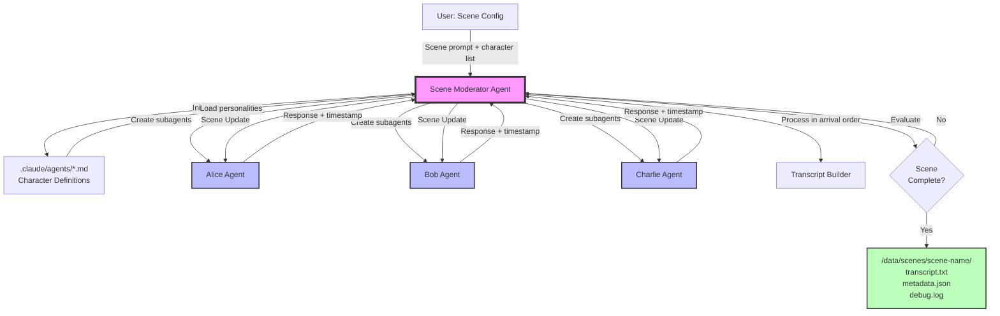
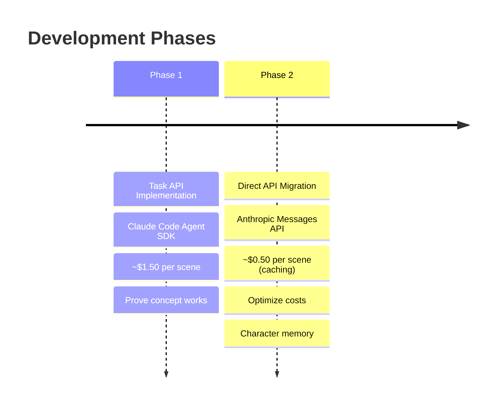

# Scene Moderator Agent - Product Requirements Document

**Version:** 1.0
**Last Updated:** 2025-10-03
**Status:** Initial Planning

---

## Project Overview

A Claude-powered scene moderator agent that orchestrates multi-character narrative scenes with autonomous character agents. The moderator manages scene flow, coordinates character responses, handles interruptions, injects world events, and produces formatted transcripts.

**This is a scene execution engine** - characters and stories are defined externally by users in their story projects.

### System Architecture at a Glance

---

## Core Purpose

Enable autonomous execution of narrative scenes where:
- Characters exhibit independent agency through separate AI agents
- Dialog emerges naturally from character interactions
- Scenes run completely hands-off from start to finish
- Output is structured for consumption by downstream AI agents

---

## Quick Navigation

### 🎯 Core Documents
Essential foundation - read these first:
- [Problem Statement](core/problem-statement.md) - What we're solving and why
- [Design Principles](core/design-principles.md) - Unchanging guidelines
- [Success Metrics](core/success-metrics.md) - How we measure success
- [Constraints](core/constraints.md) - Technical and resource boundaries
- [Feature Creation Guide](core/feature-creation.md) - How to add features

### ⚡ Features
Implementation-ready specifications:
- [Multi-Character Communication](features/multi-character-communication/) - Core scene loop
- [Response Format Parsing](features/response-format-parsing/) - Character response handling
- [Scene Completion Detection](features/scene-completion-detection/) - Natural ending detection
- [Interruption Handling](features/interruption-handling/) - Async interruption support
- [World Event Injection](features/world-event-injection/) - Moderator-driven events
- [Transcript Generation](features/transcript-generation/) - Formatted output

### 🏗️ Architecture
System design decisions:
- [Data Model](architecture/data-model.md) - Core entities and relationships
- [Performance](architecture/performance.md) - Token optimization strategies
- [Deployment](architecture/deployment.md) - Agent SDK integration

### 🔧 Development
AI implementation guides:
- [AI Guidelines](development/ai-guidelines.md) - Instructions for Claude Code
- [Standard Prompts](development/prompts/standard-prompts.md) - Reusable prompts
- [Test Criteria](development/validation/test-criteria.md) - Validation approach

---

## Implementation Status

| Feature | Status | Notes |
|---------|--------|-------|
| Multi-Character Communication | ✅ Core Complete | [Summary](features/multi-character-communication/implementation-summary.md) - Scene loop, parallel dispatch, ordering |
| Response Format Parsing | ✅ Complete | 91% coverage, salvage logic, all action types |
| Scene Completion Detection | 🔄 Partial | Max beats works, AI evaluation TODO |
| Interruption Handling | ✅ Complete | Async collection, timestamp ordering |
| World Event Injection | 📋 Planned | Deferred to next iteration |
| Transcript Generation | ✅ Complete | Formatted output, metadata support |

**Legend:**
- 📋 Planned - Specification exists, not started
- 🔄 Partial - Core working, enhancements pending
- ⚠️ Needs Revision - Attempted but requires changes
- ✅ Complete - Implemented and validated

---

## Current Phase

**Phase 1: Task API Implementation** ← We are here
- Using Claude Code Agent SDK
- Task tool for character subagents
- Single-mode, hands-off execution
- Target: Prove concept with 2-3 character scenes
- Expected cost: ~$1-2 per scene

**Future Phase 2: Direct API Migration**
- Anthropic Messages API
- Conversation thread persistence
- Prompt caching for cost optimization
- Swappable via `ICharacterAgent` interface
- Expected cost: ~$0.30-0.50 per scene

---

## Key Decisions

1. **Characters defined externally** - This is a reusable engine, not a story system
2. **Natural language responses** - Minimal structure, maximum expressiveness
3. **Interruptions by arrival order** - Async = natural chaos
4. **Moderator-driven completion** - AI evaluates scene goals, nudges to closure
5. **Test-first development** - Write tests before implementation

---

## Getting Started

### For Developers
1. Read [Design Principles](core/design-principles.md)
2. Review [AI Guidelines](development/ai-guidelines.md)
3. Start with [Multi-Character Communication](features/multi-character-communication/)
4. Follow [Test Criteria](development/validation/test-criteria.md)

### For AI Agents
1. Load [AI Guidelines](development/ai-guidelines.md) first
2. Reference feature specifications for implementation details
3. Use [Standard Prompts](development/prompts/standard-prompts.md) as templates
4. Create `lessons.md` in feature directories after implementation

---

## Questions or Issues?

This is a living document. Update as we learn from implementation and testing.

**Last significant change:** Initial PRD structure created
