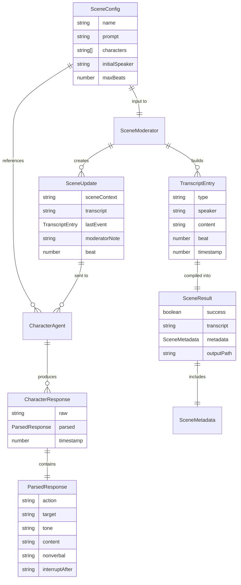
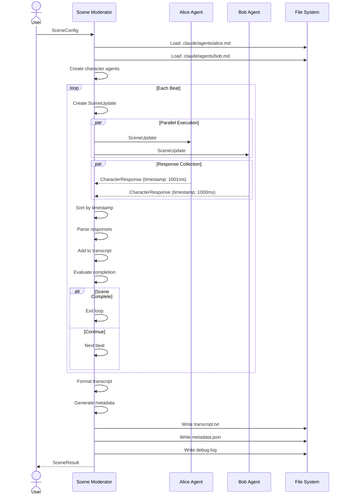

# Data Model

Core entities, types, and relationships in the scene moderator system.



---

## Core Entities

### Scene Configuration

Input that defines a scene to execute.

```typescript
interface SceneConfig {
  name: string;                  // Unique scene identifier (used for output directory)
  prompt: string;                // Scene context, goals, and setting
  characters: string[];          // Character names (refs to .claude/agents/*.md)
  initialSpeaker?: string;       // Who starts (optional, moderator decides if omitted)
  maxBeats?: number;             // Safety limit (default: 50)
}
```

**Example:**
```typescript
{
  name: "office-confrontation",
  prompt: "Alice confronts Bob about missing deadline. Goal: Bob apologizes, Alice accepts.",
  characters: ["alice", "bob"],
  initialSpeaker: "alice",
  maxBeats: 30
}
```

---

### Scene Update

What each character agent receives on each beat.

```typescript
interface SceneUpdate {
  sceneContext: string;          // Full scene prompt (goals, setting)
  transcript: string;            // Recent exchanges (formatted, last 10)
  lastEvent: TranscriptEntry | null;  // Most recent dialog or world event
  moderatorNote?: string;        // Optional guidance ("wrap up", "be assertive")
  beat: number;                  // Current beat number (0-indexed)
}
```

**Example:**
```typescript
{
  sceneContext: "Alice confronts Bob...",
  transcript: `
    Alice [TO: Bob, TONE: angry]: "We need to talk!"
    Bob [TONE: defensive]: "I can explain..."
  `,
  lastEvent: { type: 'dialog', speaker: 'Bob', content: '...' },
  moderatorNote: "Scene approaching conclusion. Wrap up your arc.",
  beat: 12
}
```

---

### Character Response

What character agents return.

```typescript
interface CharacterResponse {
  raw: string;                   // Unparsed LLM output
  parsed: ParsedResponse;        // Structured data
  timestamp: number;             // When response arrived (for interruptions)
}

interface ParsedResponse {
  action: 'speak' | 'interrupt' | 'silent' | 'react';
  target?: string;               // Who they're addressing (if directed)
  tone: string;                  // Emotional state
  content: string;               // Dialog or description
  nonverbal?: string;            // Physical action
  interruptAfter?: string;       // Phrase to interrupt after (if interrupt)
  warning?: string;              // Parse issues encountered
}
```

**Example:**
```typescript
{
  raw: '[TO: Bob, TONE: angry] "Why did you do that?"',
  parsed: {
    action: 'speak',
    target: 'Bob',
    tone: 'angry',
    content: 'Why did you do that?',
    nonverbal: undefined,
    interruptAfter: undefined
  },
  timestamp: 1696348920123
}
```

---

### Transcript Entry

Single entry in scene transcript.

```typescript
type TranscriptEntry = DialogEntry | WorldEventEntry | SystemEntry;

interface DialogEntry {
  type: 'dialog';
  speaker: string;
  action: 'speak' | 'interrupt' | 'react';
  target?: string;
  tone: string;
  content: string;
  nonverbal?: string;
  beat: number;
  timestamp: number;
}

interface WorldEventEntry {
  type: 'event';
  description: string;
  beat: number;
  timestamp: number;
}

interface SystemEntry {
  type: 'system';
  message: string;
  beat: number;
  timestamp: number;
}
```

---

### Scene Result

What moderator returns when scene completes.

```typescript
interface SceneResult {
  success: boolean;
  transcript: string;            // Formatted human-readable transcript
  metadata: SceneMetadata;
  outputPath: string;            // /data/scenes/[name]/
  error?: ErrorInfo;             // If success = false
}

interface SceneMetadata {
  name: string;
  duration: number;              // Total processing time (ms)
  totalBeats: number;
  characterCount: number;
  goalAchieved: boolean;
  completionReason: 'goal_achieved' | 'natural_end' | 'max_beats' | 'error';
  costs?: {
    totalTokens: number;
    inputTokens: number;
    outputTokens: number;
    estimatedUSD: number;
  };
  errors?: ErrorLog[];
}

interface ErrorLog {
  beat: number;
  character?: string;
  error: string;
  context?: Record<string, unknown>;
}
```

---

## Interfaces

### ICharacterAgent

Abstract contract for character agents (enables swapping implementations).

```typescript
interface ICharacterAgent {
  name: string;
  respondTo(update: SceneUpdate): Promise<CharacterResponse>;
}
```

**Implementations:**
- `TaskCharacterAgent` (Phase 1): Uses Agent SDK Task tool
- `DirectCharacterAgent` (Phase 2): Uses Anthropic Messages API

---

### ISceneModerator

Main orchestration interface.

```typescript
interface ISceneModerator {
  runScene(config: SceneConfig): Promise<SceneResult>;
}
```

**Implementation:**
- `SceneModerator`: Single concrete implementation

---

## Data Flow



---

## State Management

### Immutable Data

All data structures are **immutable**. No mutations.

```typescript
// ✅ Correct: Create new array
const newTranscript = [...transcript, newEntry];

// ❌ Wrong: Mutate existing
transcript.push(newEntry);
```

### Scene State

Moderator maintains state for single scene execution:

```typescript
interface SceneState {
  config: SceneConfig;
  agents: Map<string, ICharacterAgent>;
  transcript: TranscriptEntry[];
  currentBeat: number;
  startTime: number;
  errors: ErrorLog[];
}
```

State is **private** to moderator instance. Not persisted between scenes.

---

## File System Outputs

### Directory Structure

```
/data/scenes/[scene-name]/
├── transcript.txt       # Human-readable formatted output
├── metadata.json        # Structured scene data
├── debug.log            # Moderator decisions and errors
└── raw-responses.json   # All character responses (for analysis)
```

### transcript.txt Format

```
SCENE: Office Confrontation
CHARACTERS: Alice, Bob
GOAL: Bob apologizes, Alice accepts
GENERATED: 2025-10-03 14:32:18

---

[SCENE START]

Alice [TO: Bob, TONE: angry] "We need to talk!"

Bob [TONE: defensive, *shifts uncomfortably*] "Look, I can explain..."

[EVENT: Phone rings loudly]

...

[SCENE END - Goal: Achieved]

---

STATISTICS:
- Duration: 12 beats, 47.3s
- Total tokens: ~15,200
- Estimated cost: $0.08 USD
```

### metadata.json Format

```json
{
  "name": "office-confrontation",
  "duration": 47300,
  "totalBeats": 12,
  "characterCount": 2,
  "goalAchieved": true,
  "completionReason": "goal_achieved",
  "costs": {
    "totalTokens": 15200,
    "inputTokens": 12000,
    "outputTokens": 3200,
    "estimatedUSD": 0.08
  },
  "characters": ["alice", "bob"],
  "timestamp": "2025-10-03T14:32:18Z"
}
```

---

## Type Safety

All types defined in `/src/types/index.ts`.

**Strict TypeScript mode:**
- No `any` types
- Explicit return types
- Null safety with `| null` or `| undefined`
- Discriminated unions for variant types

**Example:**
```typescript
// Discriminated union
type TranscriptEntry =
  | { type: 'dialog'; speaker: string; content: string; }
  | { type: 'event'; description: string; }
  | { type: 'system'; message: string; };

// Type guard
function isDialogEntry(entry: TranscriptEntry): entry is DialogEntry {
  return entry.type === 'dialog';
}
```

---

## Validation

All inputs validated at boundaries:

```typescript
function validateSceneConfig(config: unknown): SceneConfig {
  if (!config || typeof config !== 'object') {
    throw new ValidationError('Config must be object');
  }

  const { name, prompt, characters } = config as Partial<SceneConfig>;

  if (!name || typeof name !== 'string') {
    throw new ValidationError('name must be non-empty string');
  }

  if (!prompt || typeof prompt !== 'string') {
    throw new ValidationError('prompt must be non-empty string');
  }

  if (!Array.isArray(characters) || characters.length === 0) {
    throw new ValidationError('characters must be non-empty array');
  }

  // ... more validation

  return config as SceneConfig;
}
```

---

*Last updated: 2025-10-03*
