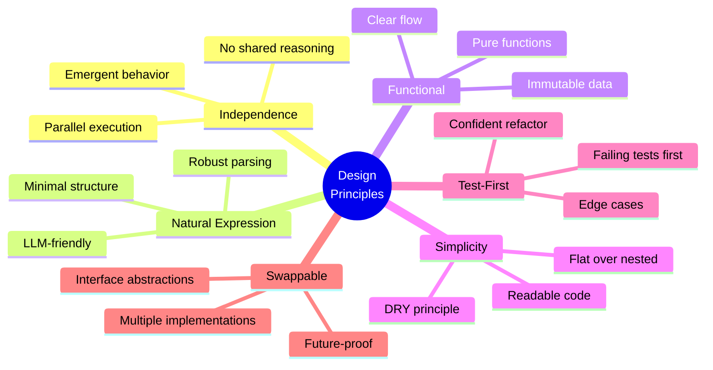

# Design Principles

These principles guide all architectural and implementation decisions. When in doubt, return to these.



---

## 1. Independence Over Control

**Characters are autonomous agents, not puppets.**

- Each character agent evaluates scenes independently
- No character knows another's internal reasoning
- Moderator coordinates but doesn't script responses
- Emergence is a feature, not a bug

**Implications:**
- Parallel agent execution is non-negotiable
- Character responses can't be predetermined
- Moderator handles coordination, not character thinking

---

## 2. Natural Expression Over Structured Data

**Dialog should feel human-written, not machine-generated.**

- Minimal required structure in responses
- Natural language format with light annotations
- Flexibility in how characters express themselves
- Avoid rigid JSON schemas that constrain creativity

**Implications:**
- Response parsing must be robust to variation
- Error handling should salvage intent, not fail on format
- Examples > schemas for guiding character agents

---

## 3. Functional Over Imperative

**Prefer pure functions and immutable data.**

- Functions transform inputs to outputs without side effects
- State changes are explicit and traceable
- Composable, testable components
- Clear data flow through the system

**Implications:**
```typescript
// Prefer this:
const updatedTranscript = addEntry(transcript, newEntry);

// Over this:
transcript.push(newEntry);
```

---

## 4. Simplicity Over Abstraction

**Direct solutions that are easy to follow.**

- Don't abstract until you see repetition (DRY principle)
- Flat is better than nested
- Explicit is better than clever
- If it takes 3 layers to understand, simplify

**Implications:**
- Start with concrete implementations
- Extract abstractions only when patterns emerge
- Favor readability over "elegance"

---

## 5. Test-First Development

**Write tests before implementation.**

- Tests clarify requirements
- Tests catch edge cases early
- Tests document expected behavior
- Tests enable confident refactoring

**Implications:**
- Every feature starts with failing tests
- Interface definitions before implementations
- Integration tests validate real agent behavior

---

## 6. Swappable Implementations

**Abstract core contracts to enable experimentation.**

- Define interfaces first (ICharacterAgent, ISceneModerator)
- Multiple implementations of same interface
- Easy to compare performance/cost/quality
- Future-proof against API changes

**Implications:**
```typescript
// This enables:
const agent = USE_DIRECT_API
  ? new DirectCharacterAgent(...)
  : new TaskCharacterAgent(...);

// Both implement ICharacterAgent
```

---

## 7. Hands-Off Execution

**Scenes run autonomously from start to finish.**

- Single-mode operation (not streaming)
- No human intervention during execution
- Complete results returned when done
- Comprehensive logging for debugging

**Implications:**
- Moderator must handle all edge cases
- Error recovery is critical
- Timeout mechanisms required
- Rich metadata for post-analysis

---

## 8. Observable Behavior

**Everything that happens should be traceable.**

- Complete transcripts capture all dialog and events
- Metadata tracks costs, timing, decisions
- Debug logs explain moderator reasoning
- Timestamps enable performance analysis

**Implications:**
- Logging is not optional
- Structured output for programmatic analysis
- Trade verbosity for visibility in Phase 1

---

## 9. Scene Engine, Not Story System

**We execute scenes; users create stories.**

- No character authoring tools in this repo
- No story arc management across scenes
- Characters defined in user's project (.claude/agents/*.md)
- Focus: scene orchestration, not content creation

**Implications:**
- Character definitions are inputs, not internal
- Scene configuration is simple and declarative
- No opinion on story structure or narrative patterns

---

## 10. Cost-Conscious Architecture

**Design for efficiency; measure before optimizing.**

- Track token usage and costs
- Provide path to cheaper implementations (Phase 2)
- Don't sacrifice quality for pennies
- Optimize hot paths, accept cost in cold paths

**Implications:**
- Phase 1: Prove it works (Task API)
- Phase 2: Optimize costs (Direct API + caching)
- Instrument everything to identify optimization targets

---

## 11. Embrace Async Chaos

**Real conversation is messy; don't fight it.**

- Interruptions arrive in unpredictable order
- Multiple characters may want to speak simultaneously
- Process responses as they arrive (timestamp order)
- Overlapping dialog is authentic, not an error

**Implications:**
- `Promise.all()` for character responses
- Sort by timestamp to preserve arrival order
- Transcript captures chaos faithfully
- Moderator can inject calm (world events) if needed

---

## 12. Failure Is Data

**Errors teach us; capture them thoroughly.**

- Don't hide failures in logs
- Malformed responses → salvage or document
- Timeout scenes → preserve partial transcripts
- Every failure improves the system

**Implications:**
- Graceful degradation over hard crashes
- Rich error context (what was the scene? which character?)
- `lessons.md` files after every implementation attempt

---

## Trade-offs We Accept

These principles create inherent trade-offs:

| Principle | Accept | To Gain |
|-----------|--------|---------|
| Independence | Unpredictability | Authenticity |
| Natural Expression | Parsing complexity | Dialog quality |
| Functional Style | More verbose code | Testability |
| Test-First | Slower initial dev | Faster iteration |
| Hands-Off | Less control | True autonomy |
| Observable | Larger outputs | Debuggability |

---

## When Principles Conflict

1. **Independence > Efficiency** - If caching reduces character autonomy, skip caching
2. **Simplicity > Performance** - Optimize only when measurements show need
3. **Observability > Output Size** - Verbose logs beat opaque failures
4. **Test Coverage > Feature Velocity** - Skipping tests creates tech debt

---

## Evolution of Principles

These aren't sacred. Update when:
- Implementation reveals false assumptions
- Better patterns emerge through practice
- User needs shift

**Process for changing principles:**
1. Propose change in lessons.md
2. Discuss trade-offs explicitly
3. Update this document with rationale
4. Propagate changes to affected features

---

*Last updated: 2025-10-03*
*Next review: After first feature implementation*
