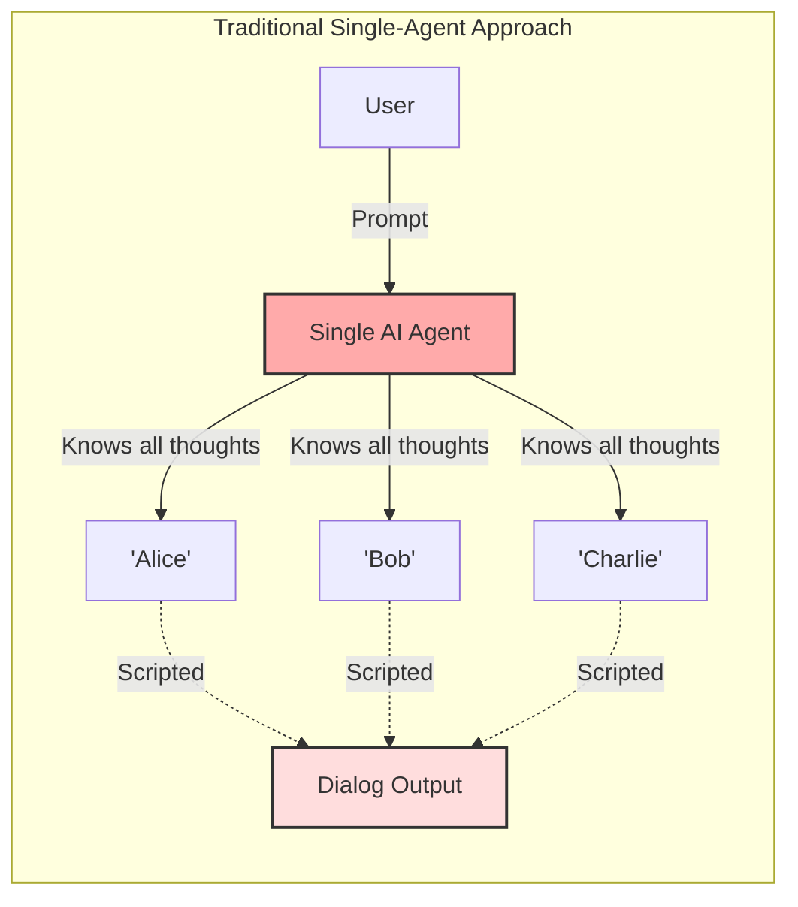
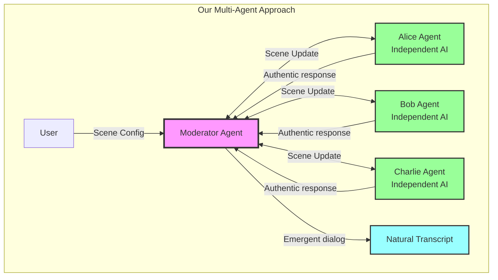

# Problem Statement

## The Problem We're Solving

### Current State: Scripted Narrative Generation

Traditional AI-driven narrative generation produces dialog through a single AI agent "roleplaying" multiple characters. This approach has fundamental limitations:

**Lack of True Independence**
- Single agent knows all characters' thoughts and motivations
- Dialog feels scripted because it IS scripted by one mind
- No genuine surprise or emergence in character interactions
- Characters can't authentically disagree or interrupt unpredictably

**Predictable Patterns**
- Conversations follow obvious arcs (conflict → misunderstanding → resolution)
- Characters wait their turn politely
- Emotional responses feel choreographed
- No authentic chaos or overlapping dialog

**Limited Expressiveness**
- Strict JSON formats constrain natural language
- Pre-defined action types limit creative responses
- System prompts fight against LLM's conversational nature

### What We Want Instead

**True Multi-Agent Emergence**
- Each character is an independent AI agent with its own context
- Characters respond authentically based solely on their personality and what they observe
- Interruptions and silence emerge organically, not by script
- Scenes unfold with genuine unpredictability within narrative constraints

**Natural Dialog Flow**
- Characters can talk over each other
- Emotional responses trigger immediate reactions
- Silence is as valid as speech
- Non-verbal communication enriches the scene

**Flexible Expression**
- Natural language responses with minimal formatting
- Characters express themselves however feels authentic
- Physical actions, tone, and subtext flow naturally

## Why This Matters

### For Narrative AI Applications

**Better Stories**
- More compelling dialog through authentic character agency
- Unexpected moments that surprise even the story creator
- Natural pacing and rhythm in conversations

**Reusable Infrastructure**
- Scene engine separates from story content
- Characters defined once, reused across scenes
- Moderator handles orchestration complexity

**Downstream AI Processing**
- Structured transcripts feed into story assembly agents
- Natural language format is easier for AI to understand than rigid JSON
- Metadata enables quality analysis and filtering

### For AI Agent Architecture

**Proof of Concept**
- Multi-agent communication via moderator pattern
- Handling async responses and interruptions
- Balancing independence with narrative goals

**Scalable Pattern**
- 2-5 agents today, potentially more tomorrow
- Clear abstraction (ICharacterAgent) enables experimentation
- Performance path from Task API → Direct API without redesign

## Success Criteria

We'll know we've solved this problem when:

1. **Scenes run autonomously** - Zero human intervention from start to transcript
2. **Dialog feels authentic** - Readers can't tell it's AI-generated multi-agent
3. **Characters stay in character** - Personality consistency throughout scene
4. **Natural emergence** - Interruptions, silence, and reactions occur organically
5. **Usable output** - Transcripts are clean, readable, and AI-parseable

## What This Is NOT

**Not a Story Writing Tool**
- We don't author characters or stories
- We execute scenes given character definitions

**Not a Chat Interface**
- No human interaction during scene execution
- Single-mode: start → run → complete

**Not a General Multi-Agent Framework**
- Specific to narrative scene orchestration
- Not designed for other multi-agent use cases

**Not a Production Narrative System (Yet)**
- Phase 1 is proof of concept
- Focus on validating the approach, not shipping features

## The Core Innovation

**Independent character agents coordinated by a moderator agent, producing emergent narrative through authentic interaction rather than scripted performance.**

This hasn't been done with Claude's agent architecture. We're proving it's possible and practical.
