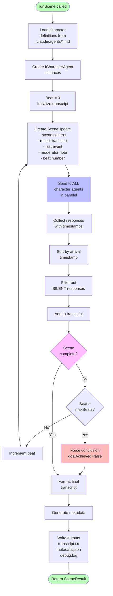

# Multi-Character Communication

## Purpose
Orchestrate parallel communication between multiple character agents through a moderator, enabling emergent dialog and authentic scene interaction.

## User Story
As a scene moderator, I want to send scene updates to all character agents simultaneously and collect their responses, so that characters can independently decide whether to speak, interrupt, or remain silent based on their personalities.

## Context
This is the **core feature** of the scene moderator agent. Everything else supports this capability. The moderator acts as a message broker between independent character agents who cannot directly communicate with each other.

## Behavior

### Happy Path Flowchart



### Happy Path Steps

1. **Initialize Scene**
   - Load character definitions from `.claude/agents/[name].md`
   - Create character agent instances (ICharacterAgent interface)
   - Prepare initial scene context

2. **Start Scene Loop**
   - Trigger initial speaker with opening prompt
   - Collect first response
   - Add to transcript

3. **For Each Beat**
   - Create SceneUpdate with:
     - Full scene context (goals, setting)
     - Recent transcript (last 10 exchanges)
     - Last event (dialog or world event)
     - Moderator note (if approaching completion)
     - Beat number
   - Send update to ALL character agents in parallel
   - Collect responses with timestamps
   - Sort by arrival time (preserves interruption order)
   - Filter out SILENT responses
   - Add remaining responses to transcript
   - Evaluate scene completion
   - Increment beat counter

4. **Complete Scene**
   - Detect goal achievement or natural ending
   - Generate final transcript
   - Save metadata and outputs
   - Return SceneResult

### Edge Cases

**No Character Responds**
- All characters return SILENT
- Moderator can inject world event to provoke response
- After 3 consecutive silent beats, consider scene stalled
- Add moderator note: "Someone should respond to move scene forward"

**All Characters Respond Simultaneously**
- Process in timestamp order
- Transcript shows rapid-fire exchange
- Acceptable and natural

**Character Agent Fails**
- One agent times out or returns error
- Log error with context
- Add system message to transcript: `[SYSTEM: CharacterName unable to respond]`
- Continue scene with remaining characters
- Don't fail entire scene for one character

**Scene Exceeds Max Beats**
- Hit safety limit (default: 50 beats)
- Log warning
- Force conclusion
- Mark goal as NOT achieved
- Return partial transcript

**Character Definition Missing**
- Specified character has no `.claude/agents/[name].md`
- Fail fast during initialization
- Clear error message: "Character '[name]' not found. Ensure .claude/agents/[name].md exists."

### Error Conditions

**Invalid Scene Configuration**
```typescript
{
  success: false,
  error: {
    code: "INVALID_CONFIG",
    message: "Scene prompt is required",
    context: { provided: config }
  }
}
```

**Character Load Failure**
```typescript
{
  success: false,
  error: {
    code: "CHARACTER_LOAD_ERROR",
    message: "Failed to load character 'alice'",
    context: { character: "alice", reason: "file not found" }
  }
}
```

**Scene Timeout**
```typescript
{
  success: true, // Partial success
  metadata: {
    goalAchieved: false,
    reason: "max_beats_exceeded",
    totalBeats: 50
  },
  transcript: "[partial transcript]"
}
```

## Examples

### Example 1: Simple 2-Character Scene

**Input:**
```typescript
{
  name: "quick-apology",
  prompt: "Bob apologizes to Alice for being late. Alice accepts.",
  characters: ["alice", "bob"],
  initialSpeaker: "bob"
}
```

**Execution:**
```
Beat 0: Bob receives initial prompt → "I'm so sorry I'm late..."
Beat 1: Both agents receive update → Alice responds, Bob silent
Beat 2: Both agents receive update → Bob responds, Alice silent
Beat 3: Both agents receive update → Alice accepts apology
Moderator detects goal achieved → End scene
```

**Output:**
```typescript
{
  success: true,
  transcript: "[formatted dialog]",
  metadata: {
    totalBeats: 4,
    goalAchieved: true,
    characterCount: 2,
    duration: 23400 // ms
  }
}
```

### Example 2: 3-Character Scene with Interruption

**Input:**
```typescript
{
  name: "heated-discussion",
  prompt: "Alice confronts Bob about project failure. Charlie mediates.",
  characters: ["alice", "bob", "charlie"],
  initialSpeaker: "alice"
}
```

**Execution:**
```
Beat 0: Alice starts with accusatory statement
Beat 1: Bob begins defensive response
       Alice interrupts mid-sentence (timestamp: 1001ms)
       Bob's response timestamp: 1000ms
       → Transcript shows Bob interrupted
Beat 2: Charlie tries to calm situation
Beat 3: All three respond (processed in timestamp order)
...continues...
```

### Example 3: Character Failure Mid-Scene

**Execution:**
```
Beat 0-5: Normal operation
Beat 6: Bob's agent times out
       → System message added
       → Scene continues with Alice and Charlie
Beat 7-10: Two-character scene concludes
```

**Output includes:**
```typescript
{
  metadata: {
    errors: [
      {
        beat: 6,
        character: "bob",
        error: "Response timeout after 30s"
      }
    ]
  }
}
```

## Dependencies

### Depends On
- **Response Format Parsing**: Parses character responses into structured format
- **Scene Completion Detection**: Evaluates when scene has achieved goals
- **Transcript Generation**: Formats responses into readable output

### Depended On By
- This is the foundational feature; all others support it

### External Dependencies
- Claude Code Agent SDK (Task tool)
- Character definitions in `.claude/agents/*.md`
- File system for output

## Non-Goals

**NOT handling:**
- Character creation or editing
- Multi-scene story arcs
- User interaction during scene
- Character memory between scenes (Phase 1)
- Visual or audio rendering
- Network communication (all local)

## Implementation Notes

### Interface Design

```typescript
interface ICharacterAgent {
  name: string;
  respondTo(update: SceneUpdate): Promise<CharacterResponse>;
}

interface SceneUpdate {
  sceneContext: string;
  transcript: string;
  lastEvent: Event | null;
  moderatorNote?: string;
  beat: number;
}

interface CharacterResponse {
  raw: string;
  parsed: ParsedResponse;
  timestamp: number;
}
```

### Parallel Execution

```typescript
// Send to all characters
const responsePromises = agents.map(agent =>
  agent.respondTo(update).then(response => ({
    ...response,
    timestamp: Date.now()
  }))
);

// Collect with error handling
const results = await Promise.allSettled(responsePromises);

// Process in timestamp order
const responses = results
  .filter(r => r.status === 'fulfilled')
  .map(r => r.value)
  .sort((a, b) => a.timestamp - b.timestamp);
```

### Scene State Management

Moderator maintains:
- Current beat number
- Complete transcript array
- Scene configuration
- Character agent instances
- Completion status

All state is immutable - new transcript created each beat.

## Performance Considerations

**Token Usage:**
- Each beat sends full context to N characters
- With 5 characters × 2000 tokens = 10k tokens per beat
- 20-beat scene = 200k input tokens
- Phase 1: Accept this cost to prove concept
- Phase 2: Optimize with Direct API + caching

**Latency:**
- Parallel execution critical
- Slowest character determines beat latency
- Typical: 2-5s per beat
- 20-beat scene: ~60-90s total

**Failure Recovery:**
- Continue scene despite single character failure
- Preserve partial transcripts
- Rich error logging for debugging
