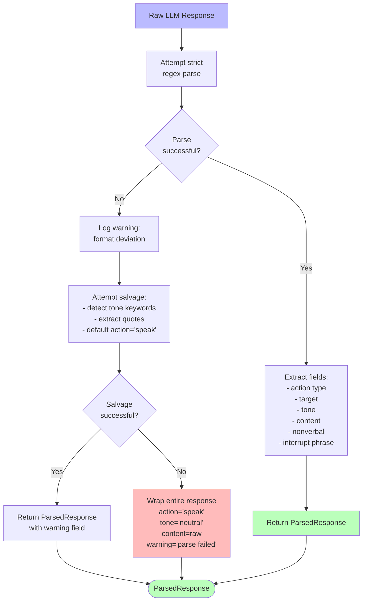

# Response Format Parsing

## Purpose
Parse natural language character responses into structured data while preserving expressiveness and handling format variations gracefully.

## User Story
As a moderator, I want to extract action type, target, tone, and content from character responses, so that I can process them consistently while allowing characters natural expression.

## Context
Characters respond in lightweight natural language format, not rigid JSON. Parser must be robust to variations while enforcing minimum required fields (action type, tone).

### Parsing Strategy



## Required Format

### Patterns

**Directed Dialog:**
```
[TO: Bob, TONE: angry] "Why did you do that?"
```

**General Dialog:**
```
[TONE: nervous] "Maybe we should all calm down."
```

**With Non-verbal:**
```
[TO: Alice, TONE: apologetic, *looks down*] "I'm sorry."
```

**Interruption:**
```
[INTERRUPT after "I want to", TONE: furious] "No! Stop right there!"
```

**Silent:**
```
[SILENT]
[SILENT, *crosses arms*]
```

**React (non-verbal only):**
```
[REACT, TONE: shocked, *drops coffee mug*]
```

## Parsing Rules

1. **Bracket Section** `[...]` comes first (required)
2. **Action Type** determined by presence of keywords:
   - Contains `INTERRUPT` → action = 'interrupt'
   - Contains `SILENT` → action = 'silent'
   - Contains `REACT` → action = 'react'
   - Otherwise → action = 'speak'

3. **Target** extracted from `TO: <name>`(optional for speak, invalid for silent/react)

4. **Tone** extracted from `TONE: <emotion>` (required for all)

5. **Non-verbal** extracted from `*...*` in brackets (optional)

6. **Interrupt Phrase** extracted from `INTERRUPT after "<phrase>"` (required if interrupt)

7. **Content** everything after `]` (required for speak/interrupt, optional for react, invalid for silent)

## Examples

### Example 1: Parse Directed Dialog

**Input:**
```
[TO: Bob, TONE: frustrated] "I can't believe this happened!"
```

**Output:**
```typescript
{
  action: 'speak',
  target: 'Bob',
  tone: 'frustrated',
  content: 'I can\'t believe this happened!',
  nonverbal: undefined,
  interruptAfter: undefined
}
```

### Example 2: Parse Interruption

**Input:**
```
[INTERRUPT after "I think we should", TONE: angry] "Absolutely not!"
```

**Output:**
```typescript
{
  action: 'interrupt',
  target: undefined,
  tone: 'angry',
  content: 'Absolutely not!',
  nonverbal: undefined,
  interruptAfter: 'I think we should'
}
```

### Example 3: Parse Silent with Action

**Input:**
```
[SILENT, *turns away and stares out window*]
```

**Output:**
```typescript
{
  action: 'silent',
  target: undefined,
  tone: undefined, // Tone optional for silent
  content: '',
  nonverbal: 'turns away and stares out window',
  interruptAfter: undefined
}
```

### Example 4: Malformed - Missing Tone

**Input:**
```
[TO: Bob] "Hello"
```

**Behavior:**
Salvage attempt - extract what's possible:
```typescript
{
  action: 'speak',
  target: 'Bob',
  tone: 'neutral', // Default
  content: 'Hello',
  warning: 'Missing required TONE field'
}
```

### Example 5: Completely Malformed

**Input:**
```
Just some random text without formatting
```

**Behavior:**
Best-effort parse:
```typescript
{
  action: 'speak',
  target: undefined,
  tone: 'neutral',
  content: 'Just some random text without formatting',
  warning: 'Failed to parse format, treated as general dialog'
}
```

## Error Handling

### Salvage Strategy

1. **Try strict parse** with regex
2. **If fails**, attempt salvage:
   - Look for tone keywords in text (angry, happy, sad, etc.)
   - Extract quoted content as dialog
   - Default action to 'speak'
3. **If salvage fails**, wrap entire response:
   ```typescript
   {
     action: 'speak',
     tone: 'neutral',
     content: rawResponse,
     warning: 'Complete parse failure, using raw response'
   }
   ```

### Never Fail

Parser never throws exceptions. Always returns ParsedResponse with optional warning field.

## Dependencies

- **String manipulation only** (no external libs)
- **Regex for pattern matching**
- Used by: Multi-Character Communication

## Non-Goals

- NOT enforcing perfect compliance (90% target)
- NOT teaching LLMs the format (done via prompts)
- NOT handling non-English languages (Phase 1)
